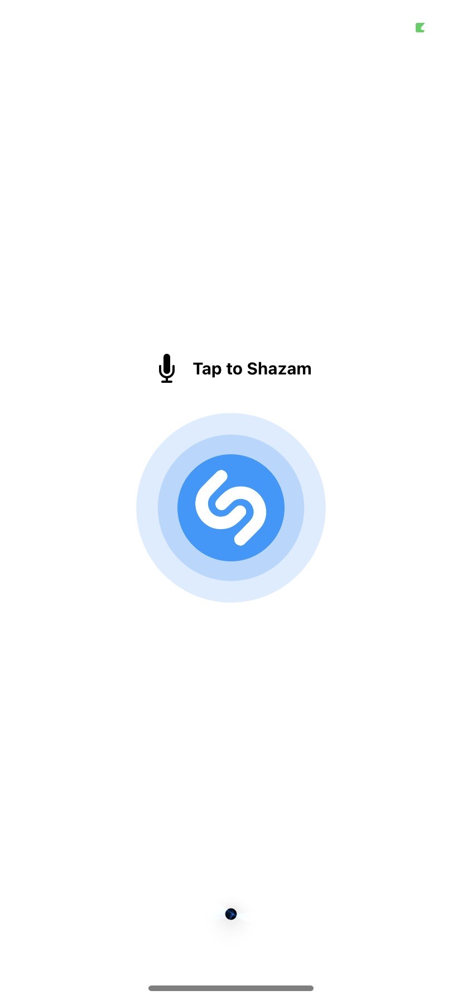
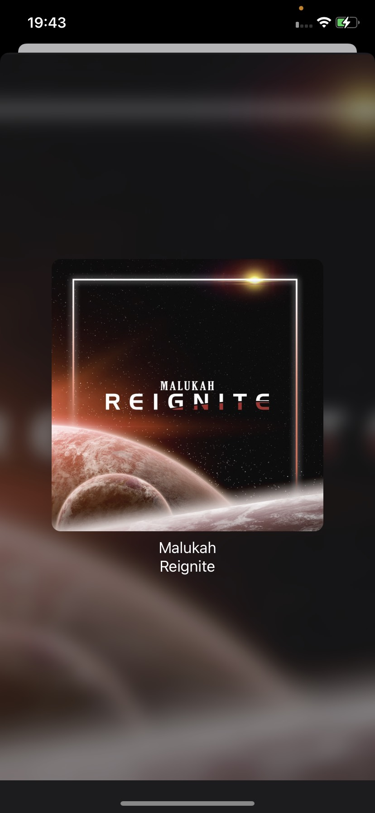

# ShazamKitPlayground
This project is my playground where I am trying to create an app similar to Shazam app in SwiftUI with ShazamKit.

<table>
<tbody>
<tr>
<td>

 </td>
<td>

 </td>
<td>

</td>
<td>

</td>
</tr>
</tbody>
</table>
